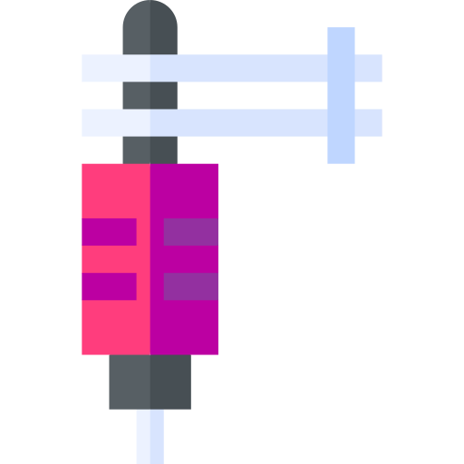

<html lang="en">
<head>
    <meta charset="UTF-8">
    <meta http-equiv="X-UA-Compatible" content="IE=edge">
    <meta name="viewport" content="width=device-width, initial-scale=1.0">
    <link rel="stylesheet" href="css/site.css">
    <title>Alejandro's Site</title>
    <link rel="icon" href="favicon.ico?v=2">
    
  
    

</head>
<body>

    
    <h1>I am Alejandro</h1>
    <h2 class="title">A driven tech savy artist.</h2>
    
    

    

      
      <h2>On a Journey</h2>
      

         To gain the necessary experience and education to develop myself into a reputable entrepreneur. 
      

    

    

    

      <h2>What I can do</h2>
      

        
        <h3>Arts</h3>
        
 From portrait drawings on paper to anime graphics on canvas and even tattoos on
            skin! I'm passionate about art and because of that I hope to transform it into a successful 
            business. Any inquiries or commissions? Just ask!
        

      

      

        
        <h3>IT/Programming</h3>
        
 Currently pursuing a career in technology! I've completed a Professional IT Support Specialist certificate developed by 
            Google. Taken a Udemy course and  learning the necessary skills to become a Web Developer and continue to further
            my education. I'm focused and willing to learn new technologies!
        

      

 

    

    

      <h2 class="outro">Reach Out</h2>
      <h3 class="outro">To book an appointment</h3>
      
We can talk about your next art piece or if you're an employer willing to hire a Junior Web Developer/Entry-level IT Support Professional!

      <a class="btn" href="#">CONTACT ME</a>
    

  

  
  
  

    <a class="footer-link" href="https://github.com/bermudez-creates">Github</a>
    <a class="footer-link" href="https://www.instagram.com/mksumsteezy/">Instagram</a>
    <a class="future-link" href="https://www.appbrewery.co/">Website</a>
    
© 2022 Alejandro Bermudez @ mksumsteezy

  

  
</body>
</html>
